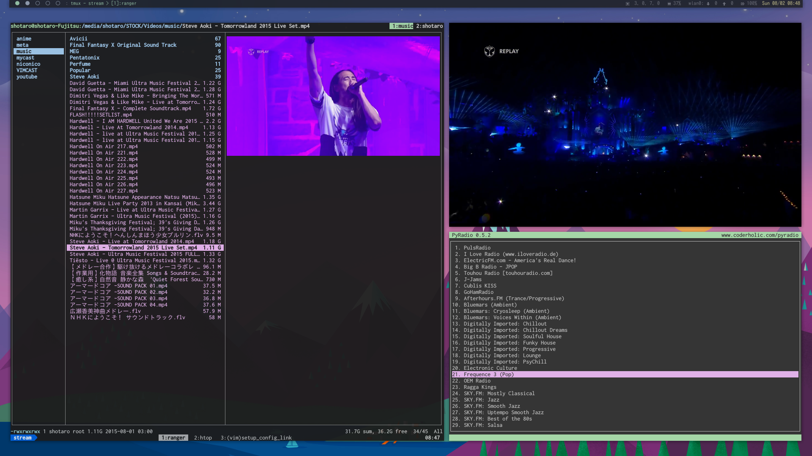
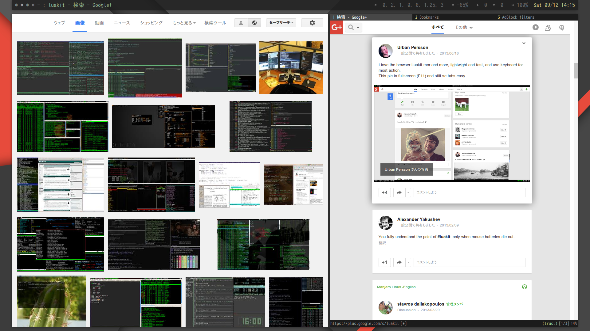
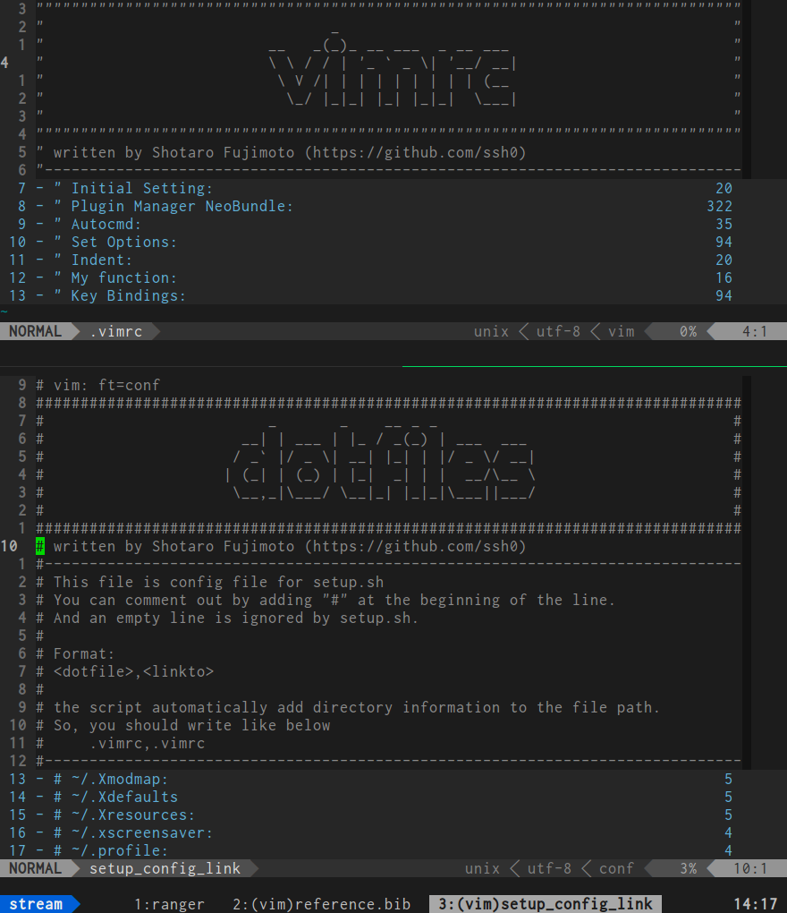

dotfiles
========

This repository contains my dotfiles and some tools in order to make it easy to make symbolic links to the right place and to add a new file into the dotfile directory.

Contents
--------

* XMonad([http://xmonad.org/](http://xmonad.org/))
    * [my xmond.hs](./xmonad/xmonad.hs)
* tmux([https://tmux.github.io/](https://tmux.github.io/))
    * [my tmux.conf](./rcfiles/tmux.conf)
* zsh([http://www.zsh.org/](http://www.zsh.org/))
    * oh-my-zsh([https://github.com/robbyrussell/oh-my-zsh](https://github.com/robbyrussell/oh-my-zsh))
    * [my zshfiles](./zshfiles/)
* vim([http://www.vim.org/](http://www.vim.org/))
    * [my vimrc](./vimfiles/vimrc)
* ranger([http://ranger.nongnu.org/](http://ranger.nongnu.org/))
    * [my ranger config files](./ranger/)
* luakit([https://mason-larobina.github.io/luakit/](https://mason-larobina.github.io/luakit/))
    * [my luakit config files](./luakit/)
* [some useful scripts](./bin/)

Screenshots
-----------







Install
-------

Clone this repository in your computer(default: ~/.dotfiles),

```bash
bash <(curl -L https://raw.githubusercontent.com/ssh0/dotfiles/master/bin/dot) clone
```

And make symbolic links by following command,

```bash
~/.dotfiles/bin/dot set
```

and this script replace existing files interactively.

If you want not to make some links, open `~/.dotfiles/setup_config_link` and comment out these lines.
The lines commented out are ignored by this script.

Usage of '[dot](./bin/dot)' command
----------------------

Link relation table is in '[configfile](./setup_config_link)'.

```bash
configfile=$HOME/.dotfiles/setup_config_link
```

* Clone ssh0's dotfile repository on your computer.  
```bash
dot clone [<dir_to_clone>]
```

* Pull remote dotfile repository (by git).  
```bash
dot pull
```

* Make symbolic link interactively.
  This command sets symbolic links configured in 'configfile'.  
  (If you have your file already, you can choose the operation
  interactively: show diff, vimdiff, overwrite, make-backup or do-nothing).  
  WIth option "-i", this script runs without interaction mode and with "-v", this script shows verbose message.
```bash
dot set [-i][-v]
```

* Move the file to the dotfile dir, make the link, and edit 'configfile'.  
```bash
dot add some_file ~/.dotfiles/path/to/the/file
```

* Unlink the selected symbolic links and copy its original files from the dotfile directory.  
```bash
dot unlink <link> [<link> <link> ... ]
```

* Remove the *all* symbolic link written in the config file 'configfile'.
```bash
dot clear
```
