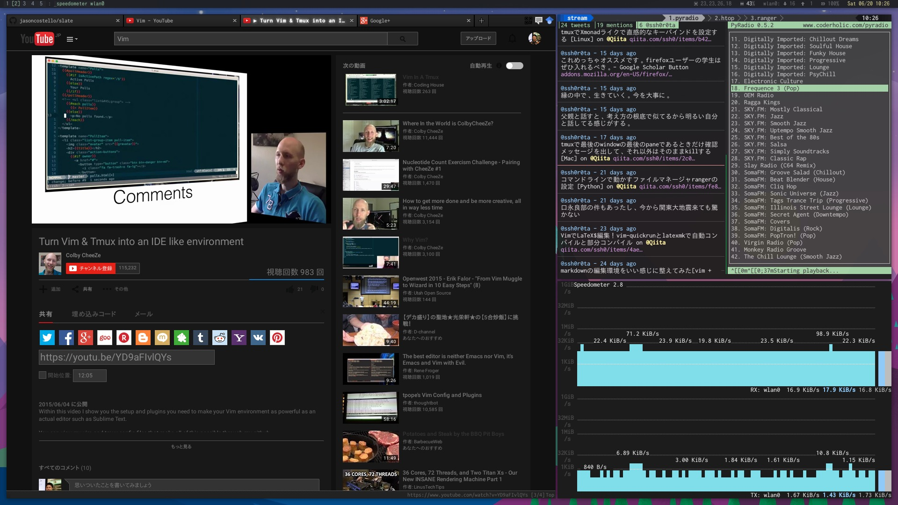
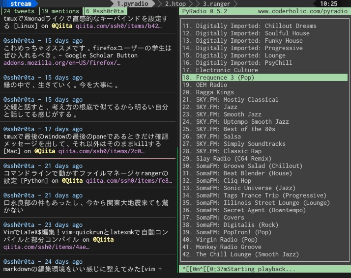
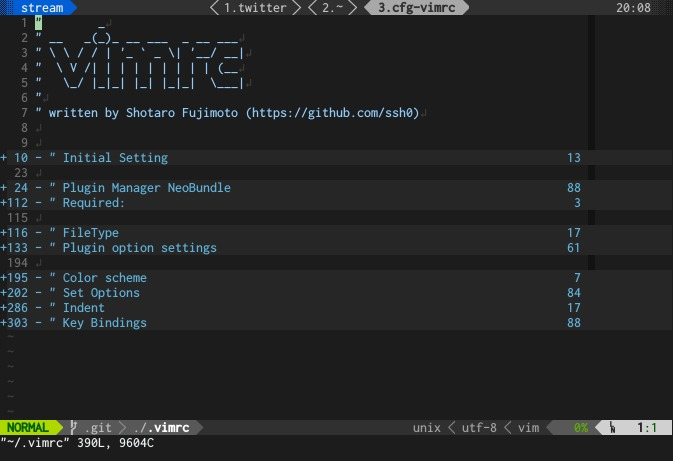

dotfiles
========

My dotfiles

- XMonad
- tmux
- zsh
- vim
- ranger
- some user script

Screenshots
-----------







You can create the symbolic links by

Install
-------

Clone this repository in your computer.

```bash
$ git clone https://github.com/ssh0/dotfiles.git -o ~/.dotfiles
```

And run:

```bash
$ cd ~/.dotfiles
$ ./dotrm && ./setup.sh
```

and this script replace existing files interactively.

- dotrm:  
  remove symbolic link which is written in `setup_config_link`

- setup.sh:  
  set symbolic link which is written in `setup_config_link`
  (if you have your file already, you can choose the operation
  interactively: "show diff", "overwrite", "make backup" or "do nothing")

You can add new link by:

```bash
$ dotmv some_file ~/.dotfiles/path/to/file
```

Then, the script automatically move the file `some_file` to
`~/.dotfiles/path/to/file` and make symbolic link to the original
direction. After that, the script launch Vim and you can edit your link
setting (file name is `setup_config_link`) manually.
