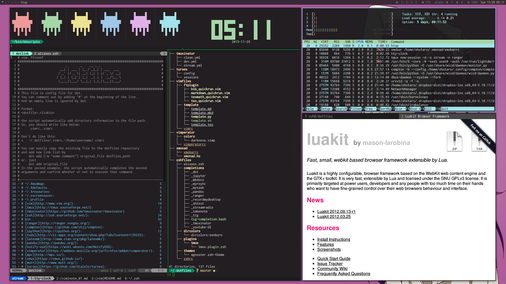

[日本語](./README_ja.md)

dotfiles
========

This repository contains my dotfiles.

I use [dot](https://github.com/ssh0/dot) in order to set symbolic link to add new file to this repository and to deal with machine specific configurations.

Contents
========

* XMonad([http://xmonad.org/](http://xmonad.org/))
    * [xmonad.hs](./xmonad/xmonad.hs)
* tmux([https://tmux.github.io/](https://tmux.github.io/))
    * [tmux.conf](./rcfiles/tmux.conf)
* zsh([http://www.zsh.org/](http://www.zsh.org/))
    * zgen([tarjoilija/zgen](https://github.com/tarjoilija/zgen))
    * [zshfiles](./zshfiles/)
* vim([http://www.vim.org/](http://www.vim.org/))
    * [vimrc](./vimfiles/vimrc)
* ranger([http://ranger.nongnu.org/](http://ranger.nongnu.org/))
    * [config files](./ranger/)
* luakit([https://mason-larobina.github.io/luakit/](https://mason-larobina.github.io/luakit/))
    * [config files](./luakit/)
* [some useful scripts](./bin/)

Screenshot
==========



Installation
============

* [Install with dot](#install_with_dot)
    * [install.sh](#install_sh)
    * [Install manually](#manually)
        1. [Install dot](#install_dot)
        2. [Clone repository and create symbolic links using dot](#clone_and_deploy_using_dot)
* [Install without dot (simple)](#install_without_dot)


## <a name="install_with_dot"> Install with dot</a>

* [dot](https://github.com/ssh0/dot)

### <a name="install_sh">install.sh</a>

Clone this repository by

```
git clone https://github.com/ssh0/dotfiles.git ~/.ssh0-dotfiles
```

Then, execute

```
cd ~/.ssh0-dotifles
./install.sh
```

[install.sh](./install.sh) will install `dot` and set the symolic links written in `dotlink`.

### <a name="manually">Install dot manually</a>

#### <a name="install_dot"> 1. Install dot</a>

* Clone repository

```
git clone https://github.com/ssh0/dot $HOME/.zsh/dot
```

* Write below lines in your {bash|zsh}rc

```
export DOT_REPO="https://github.com/your_username/dotfiles.git"
export DOT_DIR="$HOME/.dotfiles"
fpath=($HOME/.zsh/dot $fpath)  # <- for completion
source $HOME/.zsh/dot/dot.sh
```

See details at [dot's README](https://github.com/ssh0/dot).

#### <a name="clone_and_deploy_using_dot"> 2. Clone repository and create symbolic links using dot</a>

* Create dot's config file for this repository

```
mkdir -p $HOME/.config/dot
echo 'clone_repository="https://github.com/ssh0/dotfiles.git"' > $HOME/.config/dot/dotrc-ssh0
echo 'dotdir="$HOME/.dotfiles-ssh0"' >> $HOME/.config/dot/dotrc-ssh0
echo 'dotlink="$HOME/.dotfiles-ssh0/dotlink"' >> $HOME/.config/dot/dotrc-ssh0
```

* Write below lines in your {bash|zsh}rc and re-load shellrc

```
alias dot-ssh0="dot -c $HOME/.config/dot/dotrc-ssh0"
```

* Run the command below

```
dot-ssh0 clone && dot-ssh0 set -v
```

Then, this repository is cloned on your computer and the symbolic links will be created.

If files or links have already existed, this command will ask you to choose the operation for it, so don't worry about it. Or you can skip these files by using `dot-ssh0 update --ignore -v`.

This repository is work-in-progress and some files will be changed future.
If you want to update settings:

```
dot-ssh0 update -v -i
```

## <a name="install_without_dot">Install without dot (simple) </a>

Clone (or folk) this repository on your computer:

```
git clone --depth 1 --recursive https://github.com/ssh0/dotfiles.git ~/.dotfiles-ssh0
```

then, you can copy or make a symbolic from the directory to the right place(described in `dotlink`).

License
=======

All the files in this repository (except submodule) is under [WTFPL - Do What the Fuck You Want to Public License](http://www.wtfpl.net/).

See full text at [LICENSE](./LICENSE).

