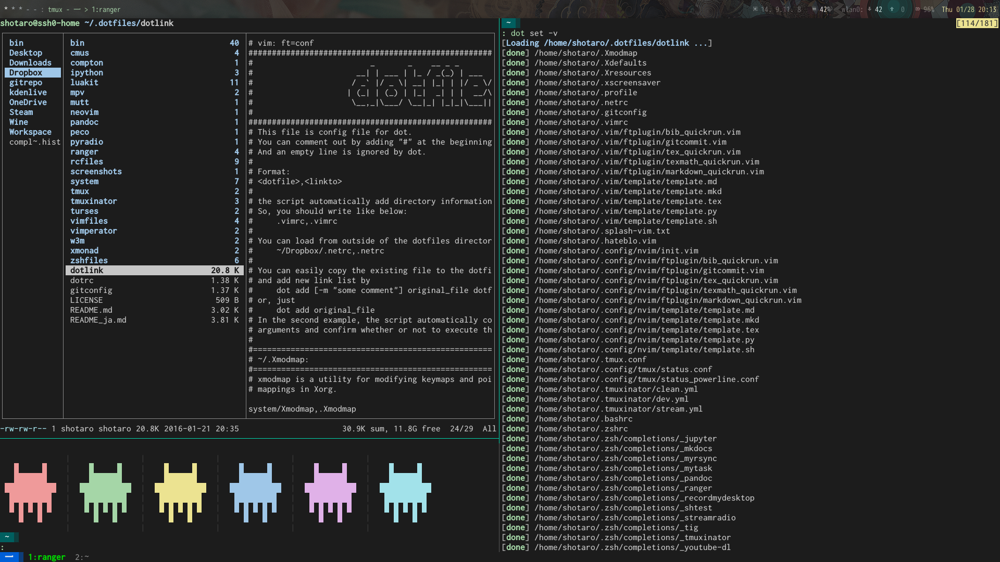

[English](./README.md)

dotfiles
========

このリポジトリには，設定ファイル群であるdotfilesが含まれています。

シンボリックリンクを張ったり，新しいファイルをリポジトリ内に取り込んだり，マシン固有の設定を管理するために，[dot](https://github.com/ssh0/dot)を使っています。

内容
====

* XMonad([http://xmonad.org/](http://xmonad.org/))
    * [xmonad.hs](./xmonad/xmonad.hs)
* tmux([https://tmux.github.io/](https://tmux.github.io/))
    * [tmux.conf](./rcfiles/tmux.conf)
* zsh([http://www.zsh.org/](http://www.zsh.org/))
    * zgen([tarjoilija/zgen](https://github.com/tarjoilija/zgen))
    * [zshfiles](./zshfiles/)
* vim([http://www.vim.org/](http://www.vim.org/))
    * [vimrc](./vimfiles/vimrc)
* ranger([http://ranger.nongnu.org/](http://ranger.nongnu.org/))
    * [config files](./ranger/)
* luakit([https://mason-larobina.github.io/luakit/](https://mason-larobina.github.io/luakit/))
    * [config files](./luakit/)
* [便利なシェルスクリプト群](./bin/)

スクリーンショット
==================




インストール
============

* [dotを用いた方法](#install_with_dot)
    * [スクリプトを用いた方法](#install_sh)
    * [手動でインストール](#manually)
        1. [dotのインストール](#install_dot)
            * [zshプラグインマネージャを使用する方法](#install_with_zsh_plugin_manager)
            * [手動でインストール](#install_manually)
        2. [dotを用いてリポジトリをクローン、シンボリックリンクを作成](#clone_and_deploy_using_dot)
* [dotを用いないシンプルな方法](#install_without_dot)

## <a name="install_with_dot">dotを用いた方法</a>

* [dot](https://github.com/ssh0/dot)

### <a name="install_sh">スクリプトを用いた方法</a>

```
git clone https://github.com/ssh0/dotfiles.git ~/.ssh0-dotfiles
```

などとしてこのリポジトリをクローンした後に，

```
cd ~/.ssh0-dotifles
./install.sh
```

を実行。

このスクリプトは一時的に`dot`コマンドを使用できるようにし，`dotlink`に書かれたファイルの対応関係に基づいてシンボリックリンクを張ります。

### <a name="manually">手動でインストール</a>

#### <a name="install_dot">1. dotのインストール</a>

##### <a name="install_with_zsh_plugin_manager">1.a zsh プラグインマネージャを使用する方法</a>

それぞれ`zshrc`に以下のように指定してください。

* [zplug](https://github.com/b4b4r07/zplug)

```
zplug "ssh0/dot"
```

* [zgen](https://github.com/tarjoilija/zgen)

```
zgen load ssh0/dot
```

* [antigen](https://github.com/zsh-users/antigen)

```
antigen bundle ssh0/dot
```

以下のように環境変数を指定することによって、dotがどのリポジトリを管理するか決定します。自分のdotfilesを既に持っている場合は、`zshrc`に追記してください。

```
export DOT_REPO="https://github.com/username/dotfiles.git"
export DOT_DIR="$HOME/.dotfiles"
```

`dot`のインストールについて詳しく知りたい方は、`dot`の[README](https://github.com/ssh0/dot/blob/master/README_ja.md)をご覧ください。

##### <a name="install_manually">1.b 手動でインストール</a>

dotのプロジェクトリポジトリを自分のPCにクローンしてください。

```
git clone https://github.com/ssh0/dot.git ~/.zsh/plugins/dot
```

次に，`bashrc`や`zshrc`に以下を記述して、dotコマンドが使えるようにしてください。

```
source $HOME/.zsh/plugins/dot
```

`bashrc`や`zshrc`の変更が適用されるように、一回ターミナルを閉じてください。

#### <a name="clone_and_deploy_using_dot">2. dotを用いてリポジトリをクローン、シンボリックリンクを作成</a>

```
DOT_REPO="https://github.com/ssh0/dotfiles.git"; DOT_DIR="$HOME/.dotfiles-ssh0"
dot clone && dot set -v
```

を実行することで、このリポジトリ内のファイルが、ローカルにクローンされ、シンボリックリンクが生成されます。もし既にファイルが存在している場合には，対話メニューが出るので，そこから操作を指定してください。

もし初めから追加したくないファイルがあるならば，`~/.dotfiles-ssh0/dotlink`の該当行を"#"でコメントアウトしてください。

## <a name="install_without_dot">dotを用いないシンプルな方法</a>

このリポジトリをクローンするかフォークしてください。

```
git clone --depth 1 --recursive  https://github.com/ssh0/dotfiles.git ~/.dotfiles-ssh0
```

お好みの設定ファイルをコピーしたり，シンボリックリンクを張ったりして，設定を反映させてください。

ライセンス
==========

このリポジトリ内の(サブモジュール化されたものを除く)すべてのファイルは[WTFPL](http://www.wtfpl.net/)ライセンスの下で公開されます。

全文は[ここ](./LICENSE)に記載してあります。

